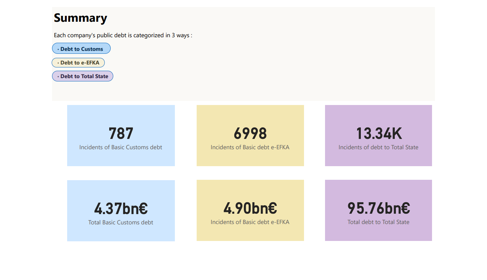

# Data-analysis-of-overdue-debts-to-State
This data analysis project aims to explore the overdue debt to the Greek State per legal person/entity that was publicised recently

## Project overview

### Dataset
This dataset contains 16.839 rows of legal persons/entities that have overdue debts to the State that are valued over 150.000 € as published

Containing 12 columns:

- Zip Code
- Latitude
- Longitude
- Area
- Basic debt DOY. Control Centers
- Basic Customs debt
- State revenues
- Total State
- Basic debt e-EFKA
- Collected e-EFKA
- Total e-EFKA

### Data Preprocessing
Data was cleaned and formatted in English language. Continuing, it was joined with the a dataset of local zipcodes and geographical information (longtitude/latitude).

### Charts and Insights
#### Chart No1 : Summary

#### Chart No2 : Map-Heatmap of Areas based on debt to Customs
This can be done with the rest 2 categories, it also features a slider to check the incidents based on the amount of debt to Customs

#### Chart No3 : Pie Chart of Based vs Collected debts
Notice that less than half the amount of debt is not collected yet. Also, an Area filter helps to check how much of uncollected debt is per Area

#### Chart No4 : Donut Chart of Top 5 Areas of Total debt
Athens posseses half of the incidents

#### Chart No5 : Bar Chart of Top 10 Areas of debt based on incidents

Debt to DOY is much more common type of debt than debt to Customs

#### Chart No6 : Pie Chart Total debt to State vs e-EFKA debt

#### Chart No7, No8, No9 : Bar Charts of Top 10 Areas with debt incidents & amount of debt for each of 3 categories

